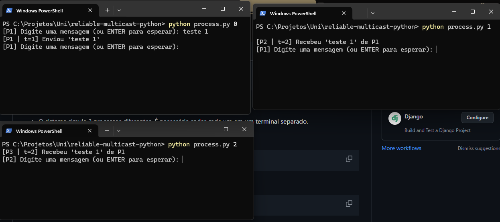
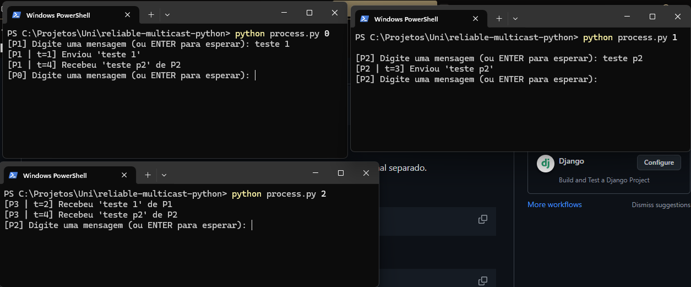

# Reliable Multicast com Relógio de Lamport - MATA88

Este projeto é uma simulação de um sistema distribuído onde processos se comunicam via **multicast confiável (reliable multicast)** e utilizam o **relógio lógico de Lamport** para marcar os eventos.

## Objetivo

Garantir que todos os processos distribuídos:
- Recebam as mesmas mensagens.
- Marquem os eventos com timestamps lógicos usando relógios de Lamport.
- Sejam capazes de enviar e receber mensagens de forma confiável.

## Execução

### 1. Pré-requisitos

- Python 3 instalado (versão 3.6 ou superior)

### 2. Clonar ou baixar o repositório

```bash
git clone https://github.com/seu-usuario/reliable-multicast-python.git
cd reliable-multicast-python
```

### 3. Rodar os processos
  - O sistema simula 3 processos diferentes. É necessário rodar cada um em um terminal separado.
  #### Terminal 1:
    >  python process.py 0

  #### Terminal 2:
    >  python process.py 1

  #### Terminal 3:
    >  python process.py 2

# Resultado:


